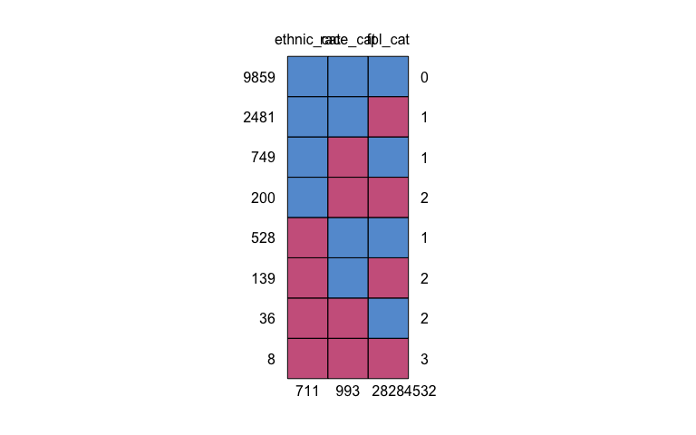

<!-- README.md is generated from README.Rmd. Please edit that file -->
Overview
========

The repository shows example code that I used to

-   Make a simulated data set,
-   Examine the missingness,
-   Specify the imputation model,
-   Pefrom multiple impuation with the `mice` package,
-   Calculate a number of agreement statistics, and
-   Pool the results with `mice`.

Also included are the slides from my presentation at CSP (2018) my final
submitted thesis (2019-06-29).

Simulate a data set
===================

Due to the sensitive nature of electronic health record (EHR) data, in
order to provide a data set for a reproducible example, I wrote code
below to simulate a data set that can be used with the rest of the code
in this example. The only similarities to the original data are the
variable names and the data categories.

Note that the eligibility requirements for screening services are based
on sex, age, and medical history. I do not simulate medical history and
so the eligibility here is based only on sex and age.

The proportions of screenings in the data were chosen to try to simulate
some data that would make for interesting example with the rest of the
code. The proportions of missingness are similar to the actual work that
I presented in that I did a little bit of rounding before simulation.

Disclaimer: All the data in this example is simulated from the following
code. Any similarities to the original data set or any other existing
data is purely by chance alone.

Simulate the data
-----------------

``` r
source(here::here("src", "simulate-data-set.R"))

valdata <- make_sim_data(n_rows = 14000, seed = seed_for_imp)
```

Do some checks and take a glimpse
---------------------------------

``` r
dplyr::glimpse(valdata)
```

    Observations: 14,000
    Variables: 42
    $ study_id         <int> 1, 2, 3, 4, 5, 6, 7, 8, 9, 10, 11, 12, 13, 14, …
    $ sex              <fct> F, F, M, M, F, M, M, M, M, F, M, F, F, F, M, M,…
    $ age_start        <int> 44, 22, 34, 47, 36, 50, 42, 29, 27, 38, 48, 63,…
    $ primary_dept     <fct> 021, 031, 039, 020, 015, 005, 026, 008, 005, 02…
    $ ethnic_cat       <fct> NH White, NH White, NH White, NH White, NH Whit…
    $ lang_cat         <fct> English, English, English, English, English, En…
    $ race_cat         <fct> Black, Black, White, White, White, White, White…
    $ fpl_cat          <fct> <=138% FPL, <=138% FPL, >138% FPL, <=138% FPL, …
    $ age_cat          <fct> "[35,51)", "[19,35)", "[19,35)", "[35,51)", "[3…
    $ elig_cervical    <fct> 1, 1, 0, 0, 1, 0, 0, 0, 0, 1, 0, 1, 1, 1, 0, 0,…
    $ elig_breast      <fct> 1, 0, 0, 0, 0, 0, 0, 0, 0, 0, 0, 1, 1, 0, 0, 0,…
    $ elig_colon       <fct> 0, 0, 0, 0, 0, 1, 0, 0, 0, 0, 0, 1, 0, 0, 0, 1,…
    $ elig_colonoscopy <fct> 0, 0, 0, 0, 0, 1, 0, 0, 0, 0, 0, 1, 0, 0, 0, 1,…
    $ elig_flexsig     <fct> 0, 0, 0, 0, 0, 1, 0, 0, 0, 0, 0, 1, 0, 0, 0, 1,…
    $ elig_fobt        <fct> 0, 0, 0, 0, 0, 1, 0, 0, 0, 0, 0, 1, 0, 0, 0, 1,…
    $ elig_bmi         <fct> 1, 1, 1, 1, 1, 1, 1, 1, 1, 1, 1, 1, 1, 1, 1, 1,…
    $ elig_flu         <fct> 0, 0, 0, 0, 0, 1, 0, 0, 0, 0, 0, 1, 0, 0, 0, 1,…
    $ elig_chlam       <fct> 0, 1, 0, 0, 0, 0, 0, 0, 0, 0, 0, 0, 0, 1, 0, 0,…
    $ elig_smoking     <fct> 1, 1, 1, 1, 1, 1, 1, 1, 1, 1, 1, 1, 1, 1, 1, 1,…
    $ elig_cholest     <fct> 1, 1, 1, 1, 1, 1, 1, 1, 1, 1, 1, 1, 1, 1, 1, 1,…
    $ dmap_cervical    <fct> 0, 0, 0, 0, 0, 0, 0, 0, 0, 0, 0, 0, 0, 1, 0, 0,…
    $ dmap_breast      <fct> 1, 0, 0, 0, 0, 0, 0, 0, 0, 0, 0, 0, 1, 0, 0, 0,…
    $ dmap_colon       <fct> 0, 0, 0, 0, 0, 0, 0, 0, 0, 0, 0, 0, 0, 0, 0, 0,…
    $ dmap_colonoscopy <fct> 0, 0, 0, 0, 0, 0, 0, 0, 0, 0, 0, 0, 0, 0, 0, 0,…
    $ dmap_flexsig     <fct> 0, 0, 0, 0, 0, 0, 0, 0, 0, 0, 0, 0, 0, 0, 0, 0,…
    $ dmap_fobt        <fct> 0, 0, 0, 0, 0, 0, 0, 0, 0, 0, 0, 0, 0, 0, 0, 0,…
    $ dmap_bmi         <fct> 0, 0, 0, 0, 0, 0, 0, 0, 1, 0, 0, 0, 0, 0, 0, 0,…
    $ dmap_flu         <fct> 0, 0, 0, 0, 0, 0, 0, 0, 0, 0, 0, 0, 0, 0, 0, 1,…
    $ dmap_chlam       <fct> 0, 0, 0, 0, 0, 0, 0, 0, 0, 0, 0, 0, 0, 1, 0, 0,…
    $ dmap_smoking     <fct> 0, 0, 0, 0, 0, 0, 0, 0, 0, 0, 0, 0, 0, 0, 0, 0,…
    $ dmap_cholest     <fct> 1, 0, 1, 0, 1, 0, 0, 0, 1, 1, 0, 0, 1, 0, 0, 1,…
    $ ehr_cervical     <fct> 1, 0, 0, 0, 0, 0, 0, 0, 0, 0, 0, 0, 0, 0, 0, 0,…
    $ ehr_breast       <fct> 1, 0, 0, 0, 0, 0, 0, 0, 0, 0, 0, 0, 0, 0, 0, 0,…
    $ ehr_colon        <fct> 0, 0, 0, 0, 0, 0, 0, 0, 0, 0, 0, 0, 0, 0, 0, 0,…
    $ ehr_colonoscopy  <fct> 0, 0, 0, 0, 0, 0, 0, 0, 0, 0, 0, 0, 0, 0, 0, 0,…
    $ ehr_flexsig      <fct> 0, 0, 0, 0, 0, 0, 0, 0, 0, 0, 0, 0, 0, 0, 0, 0,…
    $ ehr_fobt         <fct> 0, 0, 0, 0, 0, 0, 0, 0, 0, 0, 0, 0, 0, 0, 0, 0,…
    $ ehr_bmi          <fct> 1, 1, 1, 1, 1, 1, 0, 1, 0, 1, 1, 1, 1, 1, 1, 0,…
    $ ehr_flu          <fct> 0, 0, 0, 0, 0, 1, 0, 0, 0, 0, 0, 0, 0, 0, 0, 1,…
    $ ehr_chlam        <fct> 0, 0, 0, 0, 0, 0, 0, 0, 0, 0, 0, 0, 0, 0, 0, 0,…
    $ ehr_smoking      <fct> 1, 1, 1, 1, 1, 1, 1, 1, 1, 1, 1, 1, 1, 1, 1, 1,…
    $ ehr_cholest      <fct> 0, 0, 0, 0, 0, 0, 0, 1, 0, 0, 1, 0, 0, 0, 0, 0,…

EDA / explore missingness
=========================

Table One
---------

A quick table one to look at the demographics of the sample data.

``` r
#### Create a table one --------------------------------
# Table one summary stats using the tableone package

tab1 <- tableone::CreateTableOne(
  vars = c("sex", "race_cat", "ethnic_cat", "lang_cat", "fpl_cat", "age_cat"), 
  data = valdata, 
  factorVars = 
    c("sex", "race_cat", "ethnic_cat", "lang_cat", "fpl_cat", "age_cat"), 
  includeNA = TRUE
)

#### print_table_one --------------------------------
# A helper function to print the table one object to my preference.

print_table_one <- . %>% 
  print(., 
        showAllLevels = TRUE, 
        printToggle = FALSE, 
        noSpaces = TRUE
        ) %>% 
  as.data.frame(.) %>% 
  tibble::rownames_to_column(., var = "rowname") %>% 
  knitr::kable(booktabs = TRUE, 
               longtable = TRUE, 
               col.names = c("", names(.)[-1])) %>% 
  kableExtra::kable_styling(full_width = FALSE, 
                            latex_options = c("repeat_header")) %>% 
  kableExtra::column_spec(1, width = "10em")

#### Print table one --------------------------------

tab1 %>% 
  print_table_one
```

<table class="table" style="width: auto !important; margin-left: auto; margin-right: auto;">
<thead>
<tr>
<th style="text-align:left;">
</th>
<th style="text-align:left;">
level
</th>
<th style="text-align:left;">
Overall
</th>
</tr>
</thead>
<tbody>
<tr>
<td style="text-align:left;width: 10em; ">
n
</td>
<td style="text-align:left;">
</td>
<td style="text-align:left;">
14000
</td>
</tr>
<tr>
<td style="text-align:left;width: 10em; ">
sex….
</td>
<td style="text-align:left;">
F
</td>
<td style="text-align:left;">
9144 (65.3)
</td>
</tr>
<tr>
<td style="text-align:left;width: 10em; ">
X
</td>
<td style="text-align:left;">
M
</td>
<td style="text-align:left;">
4856 (34.7)
</td>
</tr>
<tr>
<td style="text-align:left;width: 10em; ">
race\_cat….
</td>
<td style="text-align:left;">
AIAN
</td>
<td style="text-align:left;">
295 (2.1)
</td>
</tr>
<tr>
<td style="text-align:left;width: 10em; ">
X.1
</td>
<td style="text-align:left;">
API
</td>
<td style="text-align:left;">
687 (4.9)
</td>
</tr>
<tr>
<td style="text-align:left;width: 10em; ">
X.2
</td>
<td style="text-align:left;">
Black
</td>
<td style="text-align:left;">
1346 (9.6)
</td>
</tr>
<tr>
<td style="text-align:left;width: 10em; ">
X.3
</td>
<td style="text-align:left;">
Multiple Races
</td>
<td style="text-align:left;">
131 (0.9)
</td>
</tr>
<tr>
<td style="text-align:left;width: 10em; ">
X.4
</td>
<td style="text-align:left;">
White
</td>
<td style="text-align:left;">
10548 (75.3)
</td>
</tr>
<tr>
<td style="text-align:left;width: 10em; ">
X.5
</td>
<td style="text-align:left;">
NA
</td>
<td style="text-align:left;">
993 (7.1)
</td>
</tr>
<tr>
<td style="text-align:left;width: 10em; ">
ethnic\_cat….
</td>
<td style="text-align:left;">
Hispanic
</td>
<td style="text-align:left;">
1405 (10.0)
</td>
</tr>
<tr>
<td style="text-align:left;width: 10em; ">
X.6
</td>
<td style="text-align:left;">
NH Other
</td>
<td style="text-align:left;">
2083 (14.9)
</td>
</tr>
<tr>
<td style="text-align:left;width: 10em; ">
X.7
</td>
<td style="text-align:left;">
NH White
</td>
<td style="text-align:left;">
9801 (70.0)
</td>
</tr>
<tr>
<td style="text-align:left;width: 10em; ">
X.8
</td>
<td style="text-align:left;">
NA
</td>
<td style="text-align:left;">
711 (5.1)
</td>
</tr>
<tr>
<td style="text-align:left;width: 10em; ">
lang\_cat….
</td>
<td style="text-align:left;">
English
</td>
<td style="text-align:left;">
11920 (85.1)
</td>
</tr>
<tr>
<td style="text-align:left;width: 10em; ">
X.9
</td>
<td style="text-align:left;">
Other
</td>
<td style="text-align:left;">
1442 (10.3)
</td>
</tr>
<tr>
<td style="text-align:left;width: 10em; ">
X.10
</td>
<td style="text-align:left;">
Spanish
</td>
<td style="text-align:left;">
638 (4.6)
</td>
</tr>
<tr>
<td style="text-align:left;width: 10em; ">
fpl\_cat….
</td>
<td style="text-align:left;">
&lt;=138% FPL
</td>
<td style="text-align:left;">
10463 (74.7)
</td>
</tr>
<tr>
<td style="text-align:left;width: 10em; ">
X.11
</td>
<td style="text-align:left;">
&gt;138% FPL
</td>
<td style="text-align:left;">
709 (5.1)
</td>
</tr>
<tr>
<td style="text-align:left;width: 10em; ">
X.12
</td>
<td style="text-align:left;">
NA
</td>
<td style="text-align:left;">
2828 (20.2)
</td>
</tr>
<tr>
<td style="text-align:left;width: 10em; ">
age\_cat….
</td>
<td style="text-align:left;">
\[19,35)
</td>
<td style="text-align:left;">
4666 (33.3)
</td>
</tr>
<tr>
<td style="text-align:left;width: 10em; ">
X.13
</td>
<td style="text-align:left;">
\[35,51)
</td>
<td style="text-align:left;">
4666 (33.3)
</td>
</tr>
<tr>
<td style="text-align:left;width: 10em; ">
X.14
</td>
<td style="text-align:left;">
\[51,65)
</td>
<td style="text-align:left;">
4668 (33.3)
</td>
</tr>
</tbody>
</table>
Visualizing missingness in the data set
---------------------------------------

The table one above shows that there are missing data in the variables
`race_cat`, `ethnic_cat`, and `fpl_cat`. When beginning to think about
how to handle the missing data in your project, visualization is a great
place to begin. The
[`naniar`](https://cran.r-project.org/web/packages/naniar/index.html)
and the
[`visdat`](https://cran.r-project.org/web/packages/visdat/index.html)
packages provide helpful plots.

### The `vis_miss()` plot

In the figure below, we get an overview of the missing values in the
data set. Missing are shown in black and observed values are shown in
gray. We see that there are only 3 variables in the data set with
missing values.

``` r
naniar::vis_miss(valdata)
```


We can also get a numeric percent missing for the variables.

``` r
naniar::miss_var_summary(valdata) %>% 
  head(., n = 10)
```

    # A tibble: 10 x 3
       variable      n_miss pct_miss
       <chr>          <int>    <dbl>
     1 fpl_cat         2828    20.2 
     2 race_cat         993     7.09
     3 ethnic_cat       711     5.08
     4 study_id           0     0   
     5 sex                0     0   
     6 age_start          0     0   
     7 primary_dept       0     0   
     8 lang_cat           0     0   
     9 age_cat            0     0   
    10 elig_cervical      0     0   

### Setting `cluster = TRUE`

It can also be useful to look at the missingness plot with the values
clustered. This gives a sense of how many values are missing in one row.
Many rows with multiple missing values can be problematic when trying to
do imputation.

I’m only going to show this plot for a few variables since we saw above
that many were completely observed.

``` r
valdata %>% 
  dplyr::select(race_cat, ethnic_cat, fpl_cat, lang_cat, sex, age_cat) %>% 
  naniar::vis_miss(., 
                   cluster = TRUE)
```


### The `VIM` package

The [`VIM`](https://cran.r-project.org/web/packages/VIM/VIM.pdf) package
also has many helpful tools for visualizing missing values. I really
like their combination bar plot and aggregation plot.

Here I have filtered the data to just those with missing values; I think
that this helps the plot to be more clear. The bar plot on the left
shows the proportion of missing values in each variable. The aggregation
plot on the right shows the combinations of missing (dark gray) and
observed (light gray) values that exist in the data.

``` r
valdata %>% 
  dplyr::select(race_cat, ethnic_cat, fpl_cat) %>% 
  VIM::aggr(., 
            col = c("gray", "gray29"), 
            numbers = TRUE, 
            sortVars = TRUE, 
            labels = names(.), 
            cex.axis = .7, 
            gap = 3, 
            ylab = c("Histogram of missing data","Pattern"))
```


     Variables sorted by number of missings: 
       Variable      Count
        fpl_cat 0.20200000
       race_cat 0.07092857
     ethnic_cat 0.05078571

Numerical summaries
-------------------

``` r
mssng_pattern <- valdata %>% 
  dplyr::select(race_cat, ethnic_cat, fpl_cat) %>% 
  mice::md.pattern(.) %>% 
  as.data.frame() %>% 
  tibble::as_tibble(.) %>% 
  tibble::rownames_to_column(., var = "count") %>% 
  dplyr::rename(., 
                # new = old
                num_available = V4)
```



``` r
mssng_pattern %>% 
  knitr::kable(.)
```

<table>
<thead>
<tr>
<th style="text-align:left;">
count
</th>
<th style="text-align:right;">
ethnic\_cat
</th>
<th style="text-align:right;">
race\_cat
</th>
<th style="text-align:right;">
fpl\_cat
</th>
<th style="text-align:right;">
num\_available
</th>
</tr>
</thead>
<tbody>
<tr>
<td style="text-align:left;">
1
</td>
<td style="text-align:right;">
1
</td>
<td style="text-align:right;">
1
</td>
<td style="text-align:right;">
1
</td>
<td style="text-align:right;">
0
</td>
</tr>
<tr>
<td style="text-align:left;">
2
</td>
<td style="text-align:right;">
1
</td>
<td style="text-align:right;">
1
</td>
<td style="text-align:right;">
0
</td>
<td style="text-align:right;">
1
</td>
</tr>
<tr>
<td style="text-align:left;">
3
</td>
<td style="text-align:right;">
1
</td>
<td style="text-align:right;">
0
</td>
<td style="text-align:right;">
1
</td>
<td style="text-align:right;">
1
</td>
</tr>
<tr>
<td style="text-align:left;">
4
</td>
<td style="text-align:right;">
1
</td>
<td style="text-align:right;">
0
</td>
<td style="text-align:right;">
0
</td>
<td style="text-align:right;">
2
</td>
</tr>
<tr>
<td style="text-align:left;">
5
</td>
<td style="text-align:right;">
0
</td>
<td style="text-align:right;">
1
</td>
<td style="text-align:right;">
1
</td>
<td style="text-align:right;">
1
</td>
</tr>
<tr>
<td style="text-align:left;">
6
</td>
<td style="text-align:right;">
0
</td>
<td style="text-align:right;">
1
</td>
<td style="text-align:right;">
0
</td>
<td style="text-align:right;">
2
</td>
</tr>
<tr>
<td style="text-align:left;">
7
</td>
<td style="text-align:right;">
0
</td>
<td style="text-align:right;">
0
</td>
<td style="text-align:right;">
1
</td>
<td style="text-align:right;">
2
</td>
</tr>
<tr>
<td style="text-align:left;">
8
</td>
<td style="text-align:right;">
0
</td>
<td style="text-align:right;">
0
</td>
<td style="text-align:right;">
0
</td>
<td style="text-align:right;">
3
</td>
</tr>
<tr>
<td style="text-align:left;">
9
</td>
<td style="text-align:right;">
711
</td>
<td style="text-align:right;">
993
</td>
<td style="text-align:right;">
2828
</td>
<td style="text-align:right;">
4532
</td>
</tr>
</tbody>
</table>
See Stef Van Buuren’s vignette for more in depth interpretation of the
table above. There’s a lot of good info there. How I interpret it is to
pay attention to the 1’s and 0’s in the main body of the table. They
correspond to what is observed (1) and missing (0) for the variables
listed in the top row.

So the first row of all 1’s means that all listed variables are
observed; the count to the left shows the number of rows in the data set
that fit this description. The last row of all 0’s means that all
variables are missing; similar that the count on the left shows the
number of rows in the data set that are missing for all the variables
shown. Then all the 1’s and 0’s in between represent some combination of
missingness among the variables.

The `naniar` package has summary that is a little simpler and gives some
of the same information. But not as much detail as the `md.pattern()` in
the `mice` package.

``` r
valdata %>% 
  naniar::miss_case_table(.) %>% 
  knitr::kable(.)
```

<table>
<thead>
<tr>
<th style="text-align:right;">
n\_miss\_in\_case
</th>
<th style="text-align:right;">
n\_cases
</th>
<th style="text-align:right;">
pct\_cases
</th>
</tr>
</thead>
<tbody>
<tr>
<td style="text-align:right;">
0
</td>
<td style="text-align:right;">
9859
</td>
<td style="text-align:right;">
70.4214286
</td>
</tr>
<tr>
<td style="text-align:right;">
1
</td>
<td style="text-align:right;">
3758
</td>
<td style="text-align:right;">
26.8428571
</td>
</tr>
<tr>
<td style="text-align:right;">
2
</td>
<td style="text-align:right;">
375
</td>
<td style="text-align:right;">
2.6785714
</td>
</tr>
<tr>
<td style="text-align:right;">
3
</td>
<td style="text-align:right;">
8
</td>
<td style="text-align:right;">
0.0571429
</td>
</tr>
</tbody>
</table>
### Number of observations per pattern of missing pairs

``` r
mssng_pairs <- valdata %>% 
  dplyr::select(ethnic_cat, race_cat, fpl_cat) %>% 
  mice::md.pairs(.)

mssng_pairs
```

    $rr
               ethnic_cat race_cat fpl_cat
    ethnic_cat      13289    12340   10608
    race_cat        12340    13007   10387
    fpl_cat         10608    10387   11172

    $rm
               ethnic_cat race_cat fpl_cat
    ethnic_cat          0      949    2681
    race_cat          667        0    2620
    fpl_cat           564      785       0

    $mr
               ethnic_cat race_cat fpl_cat
    ethnic_cat          0      667     564
    race_cat          949        0     785
    fpl_cat          2681     2620       0

    $mm
               ethnic_cat race_cat fpl_cat
    ethnic_cat        711       44     147
    race_cat           44      993     208
    fpl_cat           147      208    2828

Four missingness patterns:

-   `rr` both are observed,
-   `rm` first variable is observed, the second is missing,
-   `mr` first variable is missing, the second is observed, and
-   `mm` both variable are missing.

### Proportion of usable cases

Measures how many cases with missing data on the target variable
actually have observed values on the predictor. The proportion will be
low if both target and predictor are missing on the same cases.

``` r
prop_usable_cases <- valdata %>% 
  dplyr::select(ethnic_cat, race_cat, fpl_cat) %>% 
  mice::md.pairs(.)

with(prop_usable_cases, 
     round(mr / (mr + mm), digits = 3))
```

               ethnic_cat race_cat fpl_cat
    ethnic_cat      0.000    0.938   0.793
    race_cat        0.956    0.000   0.791
    fpl_cat         0.948    0.926   0.000

Target on the vertical axis (i.e. left), predictor on the horizontal
(i.e. top).

Interpret: Of the records with values for `ethnic_cat`, xx% have
observed information on `race_cat` and xx% have observed information on
`fplp_cat`. Etc.

This gives a sense of what variables may be good to include/exclude in
the imputation model. Higher % indicates more information and likely
good predictor; lower % indicates that the variables are missing for the
same observations and may not be good predictor.

### Number of incomplete cases

More recent advice on how many imputations to perform suggests a rule of
thumb that the number of imputations should be similar to the percentage
of cases that are incomplete. So, not just as a part of the EDA, it is
important to know the number of incomplete cases to inform the
specification of the imputation model later.

An incomplete case would be an observation (or row) with at least one
missing value. There are a number of ways to get at this information,
but the `naniar` package makes it super easy.

``` r
n_missing <- naniar::prop_miss_case(valdata)
n_missing
```

    [1] 0.2957857

So we know that in the data set 29.6% of observations have missing
values. I round this up to 30 to select the number of imputations to
perform.

Imputation
==========

Below I show some of the set up that I went through to perform the
multiple imputations using the `mice` package in R. Some resources were
absolutely indispensable in my set up and learning:

-   the [`mice` package
    documentation](https://cran.r-project.org/web/packages/mice/mice.pdf)
-   the
    [vignette](https://www.jstatsoft.org/article/view/v045i03/v45i03.pdf)
    from the Journal of Statistical Software (December 2011, Volume 45,
    Issue 3)
-   [Flexible Imputation of Missing
    Data](https://www.crcpress.com/Flexible-Imputation-of-Missing-Data/van-Buuren/p/book/9781439868249)
    by Stef van Buuren

Also, since my work was done, [online
resources](https://cran.r-project.org/web/packages/mice/vignettes/resources.html)
have been added.

For more information about MICE: Multivariate Imputation by Chained
Equations, sometimes called Fully Conditional Specification, I highly
recommend any of the materials (code or books) or published papers by
Stef van Buuren. Much can be found through his website,
[www.multiple-imputation.com](http://www.stefvanbuuren.nl/mi/).

Some set up
-----------

Here I am just going to define the number of imputations and the number
of iterations to objects for use in later code. This is just a
convenience step so that I only have to update these values in one place
if I want to change them later.

The default number of imputations in the `mice` software is 5. Based on
the exploration of the missingness above, we saw that they number of
imputations suggested is much higher. Here in this example, I am going
to keep it set at the default 5, just to limit the computation time if
someone want to run this code on their own.

In practice, my suggestion would be to “tune” the imputation using a
lower number like the default setting. Then once the imputation model is
set, perform you final or near final imputations using the higher number
as suggested by recent literature.

As far as iterations go, they tend to converge rather quickly with the
`mice` algorithm. My advice is to run them out long enough to see
whether there is convergence or not, while not getting super bogged down
with computation time.

Here I am going to continue to use the software default of 5 for our
example. In my actual work, I used 20. In your practice I would suggest
to try to use 10 to 20.

``` r
imp_num <- 5  # number of imputations, dflt = 5
iter_num <- 5  # number of iterations, dflt = 5
```

We can also tel the `mice` software to run an “initial” empty
imputation. The only effect of this is to give us some objects in R to
work with as we go through the steps. See below where I run the initial
imputation. Note that the maximum number of iterations (`maxit`) is set
to zero.

``` r
init <- mice::mice(valdata, maxit = 0)
meth <- init$method
predM <- init$predictorMatrix
# print(ini)
```

The `init` object contains lots of information that we will work with as
we go forward. Of interest for now though is the method selected for the
variables. This is the form of the imputation model for the variables to
be imputed.

``` r
meth
```

            study_id              sex        age_start     primary_dept 
                  ""               ""               ""               "" 
          ethnic_cat         lang_cat         race_cat          fpl_cat 
           "polyreg"               ""        "polyreg"         "logreg" 
             age_cat    elig_cervical      elig_breast       elig_colon 
                  ""               ""               ""               "" 
    elig_colonoscopy     elig_flexsig        elig_fobt         elig_bmi 
                  ""               ""               ""               "" 
            elig_flu       elig_chlam     elig_smoking     elig_cholest 
                  ""               ""               ""               "" 
       dmap_cervical      dmap_breast       dmap_colon dmap_colonoscopy 
                  ""               ""               ""               "" 
        dmap_flexsig        dmap_fobt         dmap_bmi         dmap_flu 
                  ""               ""               ""               "" 
          dmap_chlam     dmap_smoking     dmap_cholest     ehr_cervical 
                  ""               ""               ""               "" 
          ehr_breast        ehr_colon  ehr_colonoscopy      ehr_flexsig 
                  ""               ""               ""               "" 
            ehr_fobt          ehr_bmi          ehr_flu        ehr_chlam 
                  ""               ""               ""               "" 
         ehr_smoking      ehr_cholest 
                  ""               "" 

We see that the software made no choice for the variables without
missing data. For those with missing data, based on the type of
variable, it makes some default choices. We can override these later.

We also get the default matrix of predictors that the software chose.
This is an object of 1’s and 0’s. For those variables with no missing
and that we won’t be imputing, the values are zero. Here is a glimpse of
just those that we intend to impute.

``` r
predM[rowSums(predM) > 0, ]
```

                     study_id sex age_start primary_dept ethnic_cat lang_cat
    study_id                0   1         1            1          1        1
    sex                     1   0         1            1          1        1
    age_start               1   1         0            1          1        1
    primary_dept            1   1         1            0          1        1
    ethnic_cat              1   1         1            1          0        1
    lang_cat                1   1         1            1          1        0
    race_cat                1   1         1            1          1        1
    fpl_cat                 1   1         1            1          1        1
    age_cat                 1   1         1            1          1        1
    elig_cervical           1   1         1            1          1        1
    elig_breast             1   1         1            1          1        1
    elig_colon              1   1         1            1          1        1
    elig_colonoscopy        1   1         1            1          1        1
    elig_flexsig            1   1         1            1          1        1
    elig_fobt               1   1         1            1          1        1
    elig_bmi                1   1         1            1          1        1
    elig_flu                1   1         1            1          1        1
    elig_chlam              1   1         1            1          1        1
    elig_smoking            1   1         1            1          1        1
    elig_cholest            1   1         1            1          1        1
    dmap_cervical           1   1         1            1          1        1
    dmap_breast             1   1         1            1          1        1
    dmap_colon              1   1         1            1          1        1
    dmap_colonoscopy        1   1         1            1          1        1
    dmap_flexsig            1   1         1            1          1        1
    dmap_fobt               1   1         1            1          1        1
    dmap_bmi                1   1         1            1          1        1
    dmap_flu                1   1         1            1          1        1
    dmap_chlam              1   1         1            1          1        1
    dmap_smoking            1   1         1            1          1        1
    dmap_cholest            1   1         1            1          1        1
    ehr_cervical            1   1         1            1          1        1
    ehr_breast              1   1         1            1          1        1
    ehr_colon               1   1         1            1          1        1
    ehr_colonoscopy         1   1         1            1          1        1
    ehr_flexsig             1   1         1            1          1        1
    ehr_fobt                1   1         1            1          1        1
    ehr_bmi                 1   1         1            1          1        1
    ehr_flu                 1   1         1            1          1        1
    ehr_chlam               1   1         1            1          1        1
    ehr_smoking             1   1         1            1          1        1
    ehr_cholest             1   1         1            1          1        1
                     race_cat fpl_cat age_cat elig_cervical elig_breast
    study_id                1       1       1             0           1
    sex                     1       1       1             0           1
    age_start               1       1       1             0           1
    primary_dept            1       1       1             0           1
    ethnic_cat              1       1       1             0           1
    lang_cat                1       1       1             0           1
    race_cat                0       1       1             0           1
    fpl_cat                 1       0       1             0           1
    age_cat                 1       1       0             0           1
    elig_cervical           1       1       1             0           1
    elig_breast             1       1       1             0           0
    elig_colon              1       1       1             0           1
    elig_colonoscopy        1       1       1             0           1
    elig_flexsig            1       1       1             0           1
    elig_fobt               1       1       1             0           1
    elig_bmi                1       1       1             0           1
    elig_flu                1       1       1             0           1
    elig_chlam              1       1       1             0           1
    elig_smoking            1       1       1             0           1
    elig_cholest            1       1       1             0           1
    dmap_cervical           1       1       1             0           1
    dmap_breast             1       1       1             0           1
    dmap_colon              1       1       1             0           1
    dmap_colonoscopy        1       1       1             0           1
    dmap_flexsig            1       1       1             0           1
    dmap_fobt               1       1       1             0           1
    dmap_bmi                1       1       1             0           1
    dmap_flu                1       1       1             0           1
    dmap_chlam              1       1       1             0           1
    dmap_smoking            1       1       1             0           1
    dmap_cholest            1       1       1             0           1
    ehr_cervical            1       1       1             0           1
    ehr_breast              1       1       1             0           1
    ehr_colon               1       1       1             0           1
    ehr_colonoscopy         1       1       1             0           1
    ehr_flexsig             1       1       1             0           1
    ehr_fobt                1       1       1             0           1
    ehr_bmi                 1       1       1             0           1
    ehr_flu                 1       1       1             0           1
    ehr_chlam               1       1       1             0           1
    ehr_smoking             1       1       1             0           1
    ehr_cholest             1       1       1             0           1
                     elig_colon elig_colonoscopy elig_flexsig elig_fobt
    study_id                  1                0            0         0
    sex                       1                0            0         0
    age_start                 1                0            0         0
    primary_dept              1                0            0         0
    ethnic_cat                1                0            0         0
    lang_cat                  1                0            0         0
    race_cat                  1                0            0         0
    fpl_cat                   1                0            0         0
    age_cat                   1                0            0         0
    elig_cervical             1                0            0         0
    elig_breast               1                0            0         0
    elig_colon                0                0            0         0
    elig_colonoscopy          1                0            0         0
    elig_flexsig              1                0            0         0
    elig_fobt                 1                0            0         0
    elig_bmi                  1                0            0         0
    elig_flu                  1                0            0         0
    elig_chlam                1                0            0         0
    elig_smoking              1                0            0         0
    elig_cholest              1                0            0         0
    dmap_cervical             1                0            0         0
    dmap_breast               1                0            0         0
    dmap_colon                1                0            0         0
    dmap_colonoscopy          1                0            0         0
    dmap_flexsig              1                0            0         0
    dmap_fobt                 1                0            0         0
    dmap_bmi                  1                0            0         0
    dmap_flu                  1                0            0         0
    dmap_chlam                1                0            0         0
    dmap_smoking              1                0            0         0
    dmap_cholest              1                0            0         0
    ehr_cervical              1                0            0         0
    ehr_breast                1                0            0         0
    ehr_colon                 1                0            0         0
    ehr_colonoscopy           1                0            0         0
    ehr_flexsig               1                0            0         0
    ehr_fobt                  1                0            0         0
    ehr_bmi                   1                0            0         0
    ehr_flu                   1                0            0         0
    ehr_chlam                 1                0            0         0
    ehr_smoking               1                0            0         0
    ehr_cholest               1                0            0         0
                     elig_bmi elig_flu elig_chlam elig_smoking elig_cholest
    study_id                0        0          1            0            1
    sex                     0        0          1            0            1
    age_start               0        0          1            0            1
    primary_dept            0        0          1            0            1
    ethnic_cat              0        0          1            0            1
    lang_cat                0        0          1            0            1
    race_cat                0        0          1            0            1
    fpl_cat                 0        0          1            0            1
    age_cat                 0        0          1            0            1
    elig_cervical           0        0          1            0            1
    elig_breast             0        0          1            0            1
    elig_colon              0        0          1            0            1
    elig_colonoscopy        0        0          1            0            1
    elig_flexsig            0        0          1            0            1
    elig_fobt               0        0          1            0            1
    elig_bmi                0        0          1            0            1
    elig_flu                0        0          1            0            1
    elig_chlam              0        0          0            0            1
    elig_smoking            0        0          1            0            1
    elig_cholest            0        0          1            0            0
    dmap_cervical           0        0          1            0            1
    dmap_breast             0        0          1            0            1
    dmap_colon              0        0          1            0            1
    dmap_colonoscopy        0        0          1            0            1
    dmap_flexsig            0        0          1            0            1
    dmap_fobt               0        0          1            0            1
    dmap_bmi                0        0          1            0            1
    dmap_flu                0        0          1            0            1
    dmap_chlam              0        0          1            0            1
    dmap_smoking            0        0          1            0            1
    dmap_cholest            0        0          1            0            1
    ehr_cervical            0        0          1            0            1
    ehr_breast              0        0          1            0            1
    ehr_colon               0        0          1            0            1
    ehr_colonoscopy         0        0          1            0            1
    ehr_flexsig             0        0          1            0            1
    ehr_fobt                0        0          1            0            1
    ehr_bmi                 0        0          1            0            1
    ehr_flu                 0        0          1            0            1
    ehr_chlam               0        0          1            0            1
    ehr_smoking             0        0          1            0            1
    ehr_cholest             0        0          1            0            1
                     dmap_cervical dmap_breast dmap_colon dmap_colonoscopy
    study_id                     1           1          1                1
    sex                          1           1          1                1
    age_start                    1           1          1                1
    primary_dept                 1           1          1                1
    ethnic_cat                   1           1          1                1
    lang_cat                     1           1          1                1
    race_cat                     1           1          1                1
    fpl_cat                      1           1          1                1
    age_cat                      1           1          1                1
    elig_cervical                1           1          1                1
    elig_breast                  1           1          1                1
    elig_colon                   1           1          1                1
    elig_colonoscopy             1           1          1                1
    elig_flexsig                 1           1          1                1
    elig_fobt                    1           1          1                1
    elig_bmi                     1           1          1                1
    elig_flu                     1           1          1                1
    elig_chlam                   1           1          1                1
    elig_smoking                 1           1          1                1
    elig_cholest                 1           1          1                1
    dmap_cervical                0           1          1                1
    dmap_breast                  1           0          1                1
    dmap_colon                   1           1          0                1
    dmap_colonoscopy             1           1          1                0
    dmap_flexsig                 1           1          1                1
    dmap_fobt                    1           1          1                1
    dmap_bmi                     1           1          1                1
    dmap_flu                     1           1          1                1
    dmap_chlam                   1           1          1                1
    dmap_smoking                 1           1          1                1
    dmap_cholest                 1           1          1                1
    ehr_cervical                 1           1          1                1
    ehr_breast                   1           1          1                1
    ehr_colon                    1           1          1                1
    ehr_colonoscopy              1           1          1                1
    ehr_flexsig                  1           1          1                1
    ehr_fobt                     1           1          1                1
    ehr_bmi                      1           1          1                1
    ehr_flu                      1           1          1                1
    ehr_chlam                    1           1          1                1
    ehr_smoking                  1           1          1                1
    ehr_cholest                  1           1          1                1
                     dmap_flexsig dmap_fobt dmap_bmi dmap_flu dmap_chlam
    study_id                    1         1        1        1          1
    sex                         1         1        1        1          1
    age_start                   1         1        1        1          1
    primary_dept                1         1        1        1          1
    ethnic_cat                  1         1        1        1          1
    lang_cat                    1         1        1        1          1
    race_cat                    1         1        1        1          1
    fpl_cat                     1         1        1        1          1
    age_cat                     1         1        1        1          1
    elig_cervical               1         1        1        1          1
    elig_breast                 1         1        1        1          1
    elig_colon                  1         1        1        1          1
    elig_colonoscopy            1         1        1        1          1
    elig_flexsig                1         1        1        1          1
    elig_fobt                   1         1        1        1          1
    elig_bmi                    1         1        1        1          1
    elig_flu                    1         1        1        1          1
    elig_chlam                  1         1        1        1          1
    elig_smoking                1         1        1        1          1
    elig_cholest                1         1        1        1          1
    dmap_cervical               1         1        1        1          1
    dmap_breast                 1         1        1        1          1
    dmap_colon                  1         1        1        1          1
    dmap_colonoscopy            1         1        1        1          1
    dmap_flexsig                0         1        1        1          1
    dmap_fobt                   1         0        1        1          1
    dmap_bmi                    1         1        0        1          1
    dmap_flu                    1         1        1        0          1
    dmap_chlam                  1         1        1        1          0
    dmap_smoking                1         1        1        1          1
    dmap_cholest                1         1        1        1          1
    ehr_cervical                1         1        1        1          1
    ehr_breast                  1         1        1        1          1
    ehr_colon                   1         1        1        1          1
    ehr_colonoscopy             1         1        1        1          1
    ehr_flexsig                 1         1        1        1          1
    ehr_fobt                    1         1        1        1          1
    ehr_bmi                     1         1        1        1          1
    ehr_flu                     1         1        1        1          1
    ehr_chlam                   1         1        1        1          1
    ehr_smoking                 1         1        1        1          1
    ehr_cholest                 1         1        1        1          1
                     dmap_smoking dmap_cholest ehr_cervical ehr_breast
    study_id                    1            1            1          1
    sex                         1            1            1          1
    age_start                   1            1            1          1
    primary_dept                1            1            1          1
    ethnic_cat                  1            1            1          1
    lang_cat                    1            1            1          1
    race_cat                    1            1            1          1
    fpl_cat                     1            1            1          1
    age_cat                     1            1            1          1
    elig_cervical               1            1            1          1
    elig_breast                 1            1            1          1
    elig_colon                  1            1            1          1
    elig_colonoscopy            1            1            1          1
    elig_flexsig                1            1            1          1
    elig_fobt                   1            1            1          1
    elig_bmi                    1            1            1          1
    elig_flu                    1            1            1          1
    elig_chlam                  1            1            1          1
    elig_smoking                1            1            1          1
    elig_cholest                1            1            1          1
    dmap_cervical               1            1            1          1
    dmap_breast                 1            1            1          1
    dmap_colon                  1            1            1          1
    dmap_colonoscopy            1            1            1          1
    dmap_flexsig                1            1            1          1
    dmap_fobt                   1            1            1          1
    dmap_bmi                    1            1            1          1
    dmap_flu                    1            1            1          1
    dmap_chlam                  1            1            1          1
    dmap_smoking                0            1            1          1
    dmap_cholest                1            0            1          1
    ehr_cervical                1            1            0          1
    ehr_breast                  1            1            1          0
    ehr_colon                   1            1            1          1
    ehr_colonoscopy             1            1            1          1
    ehr_flexsig                 1            1            1          1
    ehr_fobt                    1            1            1          1
    ehr_bmi                     1            1            1          1
    ehr_flu                     1            1            1          1
    ehr_chlam                   1            1            1          1
    ehr_smoking                 1            1            1          1
    ehr_cholest                 1            1            1          1
                     ehr_colon ehr_colonoscopy ehr_flexsig ehr_fobt ehr_bmi
    study_id                 1               1           1        1       1
    sex                      1               1           1        1       1
    age_start                1               1           1        1       1
    primary_dept             1               1           1        1       1
    ethnic_cat               1               1           1        1       1
    lang_cat                 1               1           1        1       1
    race_cat                 1               1           1        1       1
    fpl_cat                  1               1           1        1       1
    age_cat                  1               1           1        1       1
    elig_cervical            1               1           1        1       1
    elig_breast              1               1           1        1       1
    elig_colon               1               1           1        1       1
    elig_colonoscopy         1               1           1        1       1
    elig_flexsig             1               1           1        1       1
    elig_fobt                1               1           1        1       1
    elig_bmi                 1               1           1        1       1
    elig_flu                 1               1           1        1       1
    elig_chlam               1               1           1        1       1
    elig_smoking             1               1           1        1       1
    elig_cholest             1               1           1        1       1
    dmap_cervical            1               1           1        1       1
    dmap_breast              1               1           1        1       1
    dmap_colon               1               1           1        1       1
    dmap_colonoscopy         1               1           1        1       1
    dmap_flexsig             1               1           1        1       1
    dmap_fobt                1               1           1        1       1
    dmap_bmi                 1               1           1        1       1
    dmap_flu                 1               1           1        1       1
    dmap_chlam               1               1           1        1       1
    dmap_smoking             1               1           1        1       1
    dmap_cholest             1               1           1        1       1
    ehr_cervical             1               1           1        1       1
    ehr_breast               1               1           1        1       1
    ehr_colon                0               1           1        1       1
    ehr_colonoscopy          1               0           1        1       1
    ehr_flexsig              1               1           0        1       1
    ehr_fobt                 1               1           1        0       1
    ehr_bmi                  1               1           1        1       0
    ehr_flu                  1               1           1        1       1
    ehr_chlam                1               1           1        1       1
    ehr_smoking              1               1           1        1       1
    ehr_cholest              1               1           1        1       1
                     ehr_flu ehr_chlam ehr_smoking ehr_cholest
    study_id               1         1           1           1
    sex                    1         1           1           1
    age_start              1         1           1           1
    primary_dept           1         1           1           1
    ethnic_cat             1         1           1           1
    lang_cat               1         1           1           1
    race_cat               1         1           1           1
    fpl_cat                1         1           1           1
    age_cat                1         1           1           1
    elig_cervical          1         1           1           1
    elig_breast            1         1           1           1
    elig_colon             1         1           1           1
    elig_colonoscopy       1         1           1           1
    elig_flexsig           1         1           1           1
    elig_fobt              1         1           1           1
    elig_bmi               1         1           1           1
    elig_flu               1         1           1           1
    elig_chlam             1         1           1           1
    elig_smoking           1         1           1           1
    elig_cholest           1         1           1           1
    dmap_cervical          1         1           1           1
    dmap_breast            1         1           1           1
    dmap_colon             1         1           1           1
    dmap_colonoscopy       1         1           1           1
    dmap_flexsig           1         1           1           1
    dmap_fobt              1         1           1           1
    dmap_bmi               1         1           1           1
    dmap_flu               1         1           1           1
    dmap_chlam             1         1           1           1
    dmap_smoking           1         1           1           1
    dmap_cholest           1         1           1           1
    ehr_cervical           1         1           1           1
    ehr_breast             1         1           1           1
    ehr_colon              1         1           1           1
    ehr_colonoscopy        1         1           1           1
    ehr_flexsig            1         1           1           1
    ehr_fobt               1         1           1           1
    ehr_bmi                1         1           1           1
    ehr_flu                0         1           1           1
    ehr_chlam              1         0           1           1
    ehr_smoking            1         1           0           1
    ehr_cholest            1         1           1           0

Specify the imputation model
----------------------------

Here I will follow the 7 steps that van Buuren suggests in order to set
up the algorithm. See his writings for more details than I will go into
here.

### Step 1 - Decide if the missing at random (MAR) assumption is reasonable

In this example, we randomly assigned missing values. So here, it kind
of has to be reasonable. In practice though, this can be challenging to
know for sure which is why the exploration of the data and the
missingness is such an important step to take as I showed above.

Assuming MAR is typically a reasonable place to start. There is
literature on sensitivity analysis with the imputations to examine if
this assumption is met. And there are techniques to model the missing
mechanism with the imputation if there is violation. This work is
outside the scope of what I hope to share here.

### Step 2 - Decide on the form of the imputation model

We want to decide the form of the model used to impute the missing
values of each variable. This can be specified on a variable by variable
basis. We saw above from the `meth` object that the software made
default decisions for us.

**FPL** – logistic regression (`logreg`), for factor with 2 levels.

**Race** – Multinomial logit regression (`polyreg`), factor with &gt; 2
levels.

**Ethnicity** – Multinomial logit regression (`polyreg`), factor with
&gt; 2 levels.

I am going to overwrite those just to show how it is done. By
overwriting the meth object we can force the algorithm to use this
later.

``` r
meth[c("ethnic_cat")] <- "polyreg"
meth[c("race_cat")] <- "polyreg"
meth[c("fpl_cat")] <- "logreg"
meth
```

            study_id              sex        age_start     primary_dept 
                  ""               ""               ""               "" 
          ethnic_cat         lang_cat         race_cat          fpl_cat 
           "polyreg"               ""        "polyreg"         "logreg" 
             age_cat    elig_cervical      elig_breast       elig_colon 
                  ""               ""               ""               "" 
    elig_colonoscopy     elig_flexsig        elig_fobt         elig_bmi 
                  ""               ""               ""               "" 
            elig_flu       elig_chlam     elig_smoking     elig_cholest 
                  ""               ""               ""               "" 
       dmap_cervical      dmap_breast       dmap_colon dmap_colonoscopy 
                  ""               ""               ""               "" 
        dmap_flexsig        dmap_fobt         dmap_bmi         dmap_flu 
                  ""               ""               ""               "" 
          dmap_chlam     dmap_smoking     dmap_cholest     ehr_cervical 
                  ""               ""               ""               "" 
          ehr_breast        ehr_colon  ehr_colonoscopy      ehr_flexsig 
                  ""               ""               ""               "" 
            ehr_fobt          ehr_bmi          ehr_flu        ehr_chlam 
                  ""               ""               ""               "" 
         ehr_smoking      ehr_cholest 
                  ""               "" 

### Step 3 - Decide the set of predictors to include in the imputation model

What variables to include in the multiple imputation model?

The advice is to include as many relevant variables as possible. One
should include all variables that are in your scientific model of
interest that will be used after imputation. Also variables that are
related to the missingness of the variables you are imputing. Van Buuren
has more advice here.

Including as many predictors as possible makes the MAR assumption more
reasonable. But with larger data sets, this is not advisable for
computation purposes. Van Buuren suggests that 15 to 25 variables will
work well. He also offers advice to cull that list.

My case is interesting. I am not doing modelling; I am calculating
scalar statistics of agreement. Also, my data set isn’t really too large
(41 variables once you ignore study ID which isn’t too important for
imputation purposes).

To aid in these decisions the `mice` package has a function that
produces a “quick predictor matrix” that is useful for dealing with data
sets with large number of variables. The software chooses by calculating
two correlations with the available cases, taking the larger, and seeing
if it meets a minimum threshold. Type `?quickpred` in the R console for
better description.

Below I run the `quickpred()` to see what the software chooses. Only
show the matrix below for those records with &gt; 1 rows or columns

``` r
predGuess <- valdata %>% 
  mice::quickpred(.)

predGuess[rowSums(predGuess) > 0, colSums(predGuess) > 0]
```

    <0 x 0 matrix>

Hmm. As I am working through this example with the simulated data, the
software did not choose any. In my actual work, it discovered about 2 to
3 important predictors for each variable.

Since we randomly generated each variable *independently*, there should
not be a high correlation between them. So as surprised as I was at
first, this really does makes sense.

In my actual work, I went to the lead investigator for insight into the
data set and suggestions on which variables would be informative. The
code chunk below shows how I took the list that they provided and
modified the `predM` object.

``` r
# Store the names of the variables in an object
var_names <- dput(names(valdata))
```

    c("study_id", "sex", "age_start", "primary_dept", "ethnic_cat", 
    "lang_cat", "race_cat", "fpl_cat", "age_cat", "elig_cervical", 
    "elig_breast", "elig_colon", "elig_colonoscopy", "elig_flexsig", 
    "elig_fobt", "elig_bmi", "elig_flu", "elig_chlam", "elig_smoking", 
    "elig_cholest", "dmap_cervical", "dmap_breast", "dmap_colon", 
    "dmap_colonoscopy", "dmap_flexsig", "dmap_fobt", "dmap_bmi", 
    "dmap_flu", "dmap_chlam", "dmap_smoking", "dmap_cholest", "ehr_cervical", 
    "ehr_breast", "ehr_colon", "ehr_colonoscopy", "ehr_flexsig", 
    "ehr_fobt", "ehr_bmi", "ehr_flu", "ehr_chlam", "ehr_smoking", 
    "ehr_cholest")

``` r
# create another vector of the names selected by the investigator
pi_list <-
  c("fpl_cat", "race_cat", "ethnic_cat", "lang_cat", "age_start", "sex", 
    "primary_dept", "ehr_cervical", "ehr_breast", "ehr_colon", 
    "ehr_colonoscopy", "dmap_breast", "dmap_colonoscopy", "ehr_cholest", 
    "dmap_cholest", "elig_cholest", "ehr_flexsig", "ehr_fobt", "ehr_bmi", 
    "ehr_flu", "ehr_chlam", "ehr_smoking", "dmap_cervical", "dmap_colon", 
    "dmap_flexsig", "dmap_fobt", "dmap_bmi", "dmap_flu", "dmap_chlam", 
    "elig_cervical", "elig_breast", "elig_colon", "elig_bmi", "elig_flu", 
    "elig_chlam", "elig_smoking")
```

Note that the investigator had me exclude the variables,
`elig_colonoscopy`, `elig_flexsig`, and `elig_fobt`, because these have
the exact same information as `elig_colon`. The eligibility for all
these screenings is the same.

We also did not include `dmap_smoking` because there was little to no
information here.

Also, we included `age_start` as a continuous variable and did not
include the categorical version of this variable, `age_cat`, hoping to
get more information.

``` r
# Make a vector of the variable names that we want to include.
vars_to_include <- var_names[(var_names %in% pi_list)]

# adjust the default prediction matrix for the variables we want to include
pred <- predM    # Set equal to the orginal pred matrix
pred[, ] <- 0    # change to all zeroes to clean it out
pred[, vars_to_include] <- 1     # Set to 1 for variables that we want
diag(pred) <- 0    # set the diagonal to zero (can't predict itself)

# take a glimpse
head(pred[, 1:10], n = 10)
```

                  study_id sex age_start primary_dept ethnic_cat lang_cat
    study_id             0   1         1            1          1        1
    sex                  0   0         1            1          1        1
    age_start            0   1         0            1          1        1
    primary_dept         0   1         1            0          1        1
    ethnic_cat           0   1         1            1          0        1
    lang_cat             0   1         1            1          1        0
    race_cat             0   1         1            1          1        1
    fpl_cat              0   1         1            1          1        1
    age_cat              0   1         1            1          1        1
    elig_cervical        0   1         1            1          1        1
                  race_cat fpl_cat age_cat elig_cervical
    study_id             1       1       0             1
    sex                  1       1       0             1
    age_start            1       1       0             1
    primary_dept         1       1       0             1
    ethnic_cat           1       1       0             1
    lang_cat             1       1       0             1
    race_cat             0       1       0             1
    fpl_cat              1       0       0             1
    age_cat              1       1       0             1
    elig_cervical        1       1       0             0

Note that there are 1s in the matrix for variables that we will not be
imputing. This will have no impact.

In the actual work, I made 3 scenarios:

1.  Full list of variables chosen by the investigator
2.  Reduced list of about half the number
3.  Very reduced list based on the defaults from the software (2-3)

Here in this example to keep it simple, I will just work with the full
list. But the other scenarios could be created by adjusting the
predictor matrix similar to above.

### Step 4 - Decide how to impute variables that are functions of other (incomplete) variables

Transformations, sum scores, etc. were not used in this data set so not
much to consider here. In some cases, there can be a lot to think about
particularly if a variable is transformed solely to meet the normality
assumption in a regression model. So do a literature review if this
issue applies to you.

In my example, I mentioned above that I am including continous
`age_start` instead of the categorical age. `fpl_cat` is a variable that
is derived from a continuous value that had missingness. We considered
to included the continuous value, but decided that it is more relevant
to our question to look at binary `fpl_cat`.

### Step 5 - Decide the order to impute the variables

The defualt in the software goes by appearance in the data set left to
right. It can be overwritten per the user’s direction. This becomes more
of an issue if there is a longitudinal nature to the data set where
missingness at an earlier time point would affect the missingness later.
So impute early to later.

I examined the imputation order by magnitude of missingness: low to high
and high to low. There did not seem to be a difference in performance or
convergence, nor an impact to the estimates. In the actual work, we
decided to impute from highest percent missing to lowest.

The code `init$visitSequence` gives the variables to be imputed and
their column positions that were chosen by the software by default.
Shown in the next chunk.

``` r
init$visitSequence
```

     [1] "study_id"         "sex"              "age_start"       
     [4] "primary_dept"     "ethnic_cat"       "lang_cat"        
     [7] "race_cat"         "fpl_cat"          "age_cat"         
    [10] "elig_cervical"    "elig_breast"      "elig_colon"      
    [13] "elig_colonoscopy" "elig_flexsig"     "elig_fobt"       
    [16] "elig_bmi"         "elig_flu"         "elig_chlam"      
    [19] "elig_smoking"     "elig_cholest"     "dmap_cervical"   
    [22] "dmap_breast"      "dmap_colon"       "dmap_colonoscopy"
    [25] "dmap_flexsig"     "dmap_fobt"        "dmap_bmi"        
    [28] "dmap_flu"         "dmap_chlam"       "dmap_smoking"    
    [31] "dmap_cholest"     "ehr_cervical"     "ehr_breast"      
    [34] "ehr_colon"        "ehr_colonoscopy"  "ehr_flexsig"     
    [37] "ehr_fobt"         "ehr_bmi"          "ehr_flu"         
    [40] "ehr_chlam"        "ehr_smoking"      "ehr_cholest"     

I override this with the following to order things as: FPL -&gt; Race
-&gt; Ethnicity

``` r
visit_order <- c("fpl_cat",  
                 "race_cat", 
                 "ethnic_cat")
visit_order
```

    [1] "fpl_cat"    "race_cat"   "ethnic_cat"

### Step 6 - Decide the number of iterations

This is to ensure convergence. The default is 5. 10 to 20 are
recommended. In actual practice, we chose 20. Here I will keep it set at
5 as defined above to keep the computation strain low.

``` r
iter_num
```

    [1] 5

### Step 7 - Decide on the number of multiply imputed data sets

The rule of thumb from more recent authors is that the number of
imputations should be similar to the percentage of cases (observations)
that are incomplete (at least 5).

The software default is 5 and we will use that for this example to keep
computation time low. We had set this previously above.

``` r
imp_num
```

    [1] 5

Run the algorithm
-----------------

All the setup work has been done and considerations made. Using the
specifications that saved in objects above, we will run the `mice`
command to impute the data sets.

Note that I wrap this in the command `system.time()` to see how long it
runs.

``` r
system.time(
imp_full <- 
  mice::mice(data = valdata, 
             m = imp_num,  # number of imputations, dflt = 5
             method = meth,  # specify the method
             predictorMatrix = pred, 
             visitSequence = visit_order, 
             seed = seed_for_imp, 
             maxit = iter_num,  # number of iterations, dflt = 5
             print = FALSE
             )
)
```

       user  system elapsed 
    225.885  10.014 237.109 

That’s elapsed time in seconds.

### Plot of convergence

We plot the values of mean and standard deviation for each variable by
number of iteration. We want to look for mixing of the lines and we do
not want to see any trend.

``` r
plot(imp_full, c("ethnic_cat", "race_cat", "fpl_cat"))
```


Calculating results and pooling
===============================

Now that we have out imputed data sets, we want to analyze each of them
and then pool the results.

When pooling results, the `mice` software has tools to help whether
pooling model results or scalar estimates. Things get messy quickly
because I am calculating a number of agreement statistics, for 11
procedures, with 7 categorical variables, and each categorical variable
has a number of levels.

When I first did these steps, I wrote many nested for loops. While this
worked and it ran, it was slow and a little bit like a black box. A wise
person once said that if you you find yourself using nested for loops in
R then you should consider using the functions from the `purrr` package.
They were right. I didn’t compare speed with the previous approach, but
the way I present here has clear points where you can check that things
make sense. This advantage makes the choice clear for me.

The first step in wrangling the results is to get the separate imputed
data sets into one data frame with a variable to track which imputation
number the data came from.

``` r
# Create an empty list
mylist <- list() 

# Put the imputed sets into the list
for (i in 1:imp_full$m) {
  mylist[[i]] <- mice::complete(imp_full, i)
}

# mylist[[1]]

# Take the list and stack the data sets into a data frame
# with an indication for the number of imputed data set
output <- dplyr::bind_rows(mylist, .id = "n_imp")

# This would do the same thing, maybe faster, but the above has the added 
# benefit of easily adding the number of the imputation so that I can track 
# things. Either way, I chose the one above as my preference.
# df <- do.call(rbind, mylist)
# df

# Check it out that the dimensions make sense and spot check the data
dplyr::glimpse(output)
```

    Observations: 70,000
    Variables: 43
    $ n_imp            <chr> "1", "1", "1", "1", "1", "1", "1", "1", "1", "1…
    $ study_id         <int> 1, 2, 3, 4, 5, 6, 7, 8, 9, 10, 11, 12, 13, 14, …
    $ sex              <fct> F, F, M, M, F, M, M, M, M, F, M, F, F, F, M, M,…
    $ age_start        <int> 44, 22, 34, 47, 36, 50, 42, 29, 27, 38, 48, 63,…
    $ primary_dept     <fct> 021, 031, 039, 020, 015, 005, 026, 008, 005, 02…
    $ ethnic_cat       <fct> NH White, NH White, NH White, NH White, NH Whit…
    $ lang_cat         <fct> English, English, English, English, English, En…
    $ race_cat         <fct> Black, Black, White, White, White, White, White…
    $ fpl_cat          <fct> <=138% FPL, <=138% FPL, >138% FPL, <=138% FPL, …
    $ age_cat          <fct> "[35,51)", "[19,35)", "[19,35)", "[35,51)", "[3…
    $ elig_cervical    <fct> 1, 1, 0, 0, 1, 0, 0, 0, 0, 1, 0, 1, 1, 1, 0, 0,…
    $ elig_breast      <fct> 1, 0, 0, 0, 0, 0, 0, 0, 0, 0, 0, 1, 1, 0, 0, 0,…
    $ elig_colon       <fct> 0, 0, 0, 0, 0, 1, 0, 0, 0, 0, 0, 1, 0, 0, 0, 1,…
    $ elig_colonoscopy <fct> 0, 0, 0, 0, 0, 1, 0, 0, 0, 0, 0, 1, 0, 0, 0, 1,…
    $ elig_flexsig     <fct> 0, 0, 0, 0, 0, 1, 0, 0, 0, 0, 0, 1, 0, 0, 0, 1,…
    $ elig_fobt        <fct> 0, 0, 0, 0, 0, 1, 0, 0, 0, 0, 0, 1, 0, 0, 0, 1,…
    $ elig_bmi         <fct> 1, 1, 1, 1, 1, 1, 1, 1, 1, 1, 1, 1, 1, 1, 1, 1,…
    $ elig_flu         <fct> 0, 0, 0, 0, 0, 1, 0, 0, 0, 0, 0, 1, 0, 0, 0, 1,…
    $ elig_chlam       <fct> 0, 1, 0, 0, 0, 0, 0, 0, 0, 0, 0, 0, 0, 1, 0, 0,…
    $ elig_smoking     <fct> 1, 1, 1, 1, 1, 1, 1, 1, 1, 1, 1, 1, 1, 1, 1, 1,…
    $ elig_cholest     <fct> 1, 1, 1, 1, 1, 1, 1, 1, 1, 1, 1, 1, 1, 1, 1, 1,…
    $ dmap_cervical    <fct> 0, 0, 0, 0, 0, 0, 0, 0, 0, 0, 0, 0, 0, 1, 0, 0,…
    $ dmap_breast      <fct> 1, 0, 0, 0, 0, 0, 0, 0, 0, 0, 0, 0, 1, 0, 0, 0,…
    $ dmap_colon       <fct> 0, 0, 0, 0, 0, 0, 0, 0, 0, 0, 0, 0, 0, 0, 0, 0,…
    $ dmap_colonoscopy <fct> 0, 0, 0, 0, 0, 0, 0, 0, 0, 0, 0, 0, 0, 0, 0, 0,…
    $ dmap_flexsig     <fct> 0, 0, 0, 0, 0, 0, 0, 0, 0, 0, 0, 0, 0, 0, 0, 0,…
    $ dmap_fobt        <fct> 0, 0, 0, 0, 0, 0, 0, 0, 0, 0, 0, 0, 0, 0, 0, 0,…
    $ dmap_bmi         <fct> 0, 0, 0, 0, 0, 0, 0, 0, 1, 0, 0, 0, 0, 0, 0, 0,…
    $ dmap_flu         <fct> 0, 0, 0, 0, 0, 0, 0, 0, 0, 0, 0, 0, 0, 0, 0, 1,…
    $ dmap_chlam       <fct> 0, 0, 0, 0, 0, 0, 0, 0, 0, 0, 0, 0, 0, 1, 0, 0,…
    $ dmap_smoking     <fct> 0, 0, 0, 0, 0, 0, 0, 0, 0, 0, 0, 0, 0, 0, 0, 0,…
    $ dmap_cholest     <fct> 1, 0, 1, 0, 1, 0, 0, 0, 1, 1, 0, 0, 1, 0, 0, 1,…
    $ ehr_cervical     <fct> 1, 0, 0, 0, 0, 0, 0, 0, 0, 0, 0, 0, 0, 0, 0, 0,…
    $ ehr_breast       <fct> 1, 0, 0, 0, 0, 0, 0, 0, 0, 0, 0, 0, 0, 0, 0, 0,…
    $ ehr_colon        <fct> 0, 0, 0, 0, 0, 0, 0, 0, 0, 0, 0, 0, 0, 0, 0, 0,…
    $ ehr_colonoscopy  <fct> 0, 0, 0, 0, 0, 0, 0, 0, 0, 0, 0, 0, 0, 0, 0, 0,…
    $ ehr_flexsig      <fct> 0, 0, 0, 0, 0, 0, 0, 0, 0, 0, 0, 0, 0, 0, 0, 0,…
    $ ehr_fobt         <fct> 0, 0, 0, 0, 0, 0, 0, 0, 0, 0, 0, 0, 0, 0, 0, 0,…
    $ ehr_bmi          <fct> 1, 1, 1, 1, 1, 1, 0, 1, 0, 1, 1, 1, 1, 1, 1, 0,…
    $ ehr_flu          <fct> 0, 0, 0, 0, 0, 1, 0, 0, 0, 0, 0, 0, 0, 0, 0, 1,…
    $ ehr_chlam        <fct> 0, 0, 0, 0, 0, 0, 0, 0, 0, 0, 0, 0, 0, 0, 0, 0,…
    $ ehr_smoking      <fct> 1, 1, 1, 1, 1, 1, 1, 1, 1, 1, 1, 1, 1, 1, 1, 1,…
    $ ehr_cholest      <fct> 0, 0, 0, 0, 0, 0, 0, 1, 0, 0, 1, 0, 0, 0, 0, 0,…

``` r
# dim(output)
# head(output)
# tail(output)
```

Then I gather the data into a tidy format so that I can group by
category or imputation number or whatever I want really. I employ a user
written function because it’s a little bit of work to do this.

``` r
source(here::here("src", "make_df_long.R"))
output_long <- make_df_long(df = output)
```

We can check that this works by grouping by category and checking that
the sums and counts of some of the variables match.

``` r
output_long %>% 
  group_by(cat) %>% 
  summarise(
    n = n(), 
    ELIG = sum(as.numeric(elig), na.rm = TRUE), 
    EHR = sum(as.numeric(ehr), na.rm = TRUE), 
    DMAP = sum(as.numeric(dmap), na.rm = TRUE), 
    id = sum(as.numeric(study_id), na.rm = TRUE), 
    age = sum(age_start, na.rm = TRUE)
  )
```

    # A tibble: 7 x 7
      cat            n   ELIG    EHR  DMAP         id      age
      <chr>      <int>  <dbl>  <dbl> <dbl>      <dbl>    <int>
    1 age       770000 409795 208525 84905 5390385000 32458360
    2 all       770000 409795 208525 84905 5390385000 32458360
    3 ethnicity 770000 409795 208525 84905 5390385000 32458360
    4 fpl       770000 409795 208525 84905 5390385000 32458360
    5 language  770000 409795 208525 84905 5390385000 32458360
    6 race      770000 409795 208525 84905 5390385000 32458360
    7 sex       770000 409795 208525 84905 5390385000 32458360

I now want the data to be grouped by (1) procedure, (2) category, (3)
level, and (4) imputation number.

``` r
output_nested <- output_long %>% 
  group_by(proc, cat, level, n_imp) %>% 
  tidyr::nest()

output_nested %>% 
  head(., n = 10)
```

    # A tibble: 10 x 5
       proc     cat   level n_imp data                 
       <chr>    <chr> <chr> <chr> <list>               
     1 cervical all   all   1     <tibble [14,000 × 6]>
     2 cervical all   all   2     <tibble [14,000 × 6]>
     3 cervical all   all   3     <tibble [14,000 × 6]>
     4 cervical all   all   4     <tibble [14,000 × 6]>
     5 cervical all   all   5     <tibble [14,000 × 6]>
     6 breast   all   all   1     <tibble [14,000 × 6]>
     7 breast   all   all   2     <tibble [14,000 × 6]>
     8 breast   all   all   3     <tibble [14,000 × 6]>
     9 breast   all   all   4     <tibble [14,000 × 6]>
    10 breast   all   all   5     <tibble [14,000 × 6]>

``` r
# df_nested$data[[1]]
# head(df_nested$data[[1]])
# tail(df_nested$data[[1]])
```

We now have a nested column of the data by the groups and imputations
that we want. Next, we need to calculate two columns: Q - the estimates,
and U - their standard errors. These needed user written functions to
make the process automated and efficient.

``` r
source(here::here("src", "calc-stats.R"))
output_nested <- output_nested %>% 
  mutate(Q = purrr::map(.x = data, .f = calc_stats_p), 
         U = purrr::map(.x = data, .f = calc_stats_se))

output_nested %>% 
  head(., n = 10)
```

    # A tibble: 10 x 7
       proc     cat   level n_imp data              Q             U            
       <chr>    <chr> <chr> <chr> <list>            <list>        <list>       
     1 cervical all   all   1     <tibble [14,000 … <df[,2] [23 … <df[,2] [23 …
     2 cervical all   all   2     <tibble [14,000 … <df[,2] [23 … <df[,2] [23 …
     3 cervical all   all   3     <tibble [14,000 … <df[,2] [23 … <df[,2] [23 …
     4 cervical all   all   4     <tibble [14,000 … <df[,2] [23 … <df[,2] [23 …
     5 cervical all   all   5     <tibble [14,000 … <df[,2] [23 … <df[,2] [23 …
     6 breast   all   all   1     <tibble [14,000 … <df[,2] [23 … <df[,2] [23 …
     7 breast   all   all   2     <tibble [14,000 … <df[,2] [23 … <df[,2] [23 …
     8 breast   all   all   3     <tibble [14,000 … <df[,2] [23 … <df[,2] [23 …
     9 breast   all   all   4     <tibble [14,000 … <df[,2] [23 … <df[,2] [23 …
    10 breast   all   all   5     <tibble [14,000 … <df[,2] [23 … <df[,2] [23 …

``` r
# output_nested$Q[[1]]
# output_nested$U[[1]]
```

Next, we want to unnest the results from calculating the statistics and
the standard errors.

``` r
output_nested <- output_nested %>% 
  tidyr::unnest(Q, U) %>% 
  dplyr::select(-stat1) %>% 
  mutate_at(.vars = vars(Q, U), 
            .funs = funs(as.numeric))

output_nested %>% 
  head(., n = 10)
```

    # A tibble: 10 x 7
       proc     cat   level n_imp stat            Q     U
       <chr>    <chr> <chr> <chr> <chr>       <dbl> <dbl>
     1 cervical all   all   1     n       14000         0
     2 cervical all   all   1     a         844         0
     3 cervical all   all   1     b        1980         0
     4 cervical all   all   1     c        1893         0
     5 cervical all   all   1     d        9283         0
     6 cervical all   all   1     EHR.n    2824         0
     7 cervical all   all   1     EHR.p       0.202     0
     8 cervical all   all   1     DMAP.n   2737         0
     9 cervical all   all   1     DMAP.p      0.196     0
    10 cervical all   all   1     Combo.n  4717         0

We want to re-`group_by` the data by procedure, category, level, and
type of statistic. This step gives us the nested estimates and variances
for all the imputed sets which we can now pool the resuls.

``` r
output_nested <- output_nested %>% 
  group_by(proc, cat, level, stat) %>% 
  tidyr::nest()
```

Pool and unnest. Note that my user written function `mi_pool` is really
just a wrapper for the `pool.scalar()` function in the `mice` package.

``` r
output_nested <- output_nested %>% 
  mutate(pooled = purrr::map(.x = data, .f = mi_pool))
```

    Error in mice::pool.scalar(Q, U, method = "rubin"): unused argument (method = "rubin")

``` r
output_nested %>% 
  head(., n = 10)
```

    # A tibble: 10 x 5
       proc     cat   level stat    data            
       <chr>    <chr> <chr> <chr>   <list>          
     1 cervical all   all   n       <tibble [5 × 3]>
     2 cervical all   all   a       <tibble [5 × 3]>
     3 cervical all   all   b       <tibble [5 × 3]>
     4 cervical all   all   c       <tibble [5 × 3]>
     5 cervical all   all   d       <tibble [5 × 3]>
     6 cervical all   all   EHR.n   <tibble [5 × 3]>
     7 cervical all   all   EHR.p   <tibble [5 × 3]>
     8 cervical all   all   DMAP.n  <tibble [5 × 3]>
     9 cervical all   all   DMAP.p  <tibble [5 × 3]>
    10 cervical all   all   Combo.n <tibble [5 × 3]>

Unnest the pooled results, we see that for each procedure, by category,
by strata, we have for each statistic, the results that the pooling in
`mice` provides.

``` r
output_nested <- output_nested %>% 
  tidyr::unnest(pooled)
```

    Error: object 'pooled' not found

``` r
output_nested %>% 
  dplyr::select(-data) %>% 
  dplyr::glimpse(.)
```

    Observations: 4,807
    Variables: 4
    $ proc  <chr> "cervical", "cervical", "cervical", "cervical", "cervical"…
    $ cat   <chr> "all", "all", "all", "all", "all", "all", "all", "all", "a…
    $ level <chr> "all", "all", "all", "all", "all", "all", "all", "all", "a…
    $ stat  <chr> "n", "a", "b", "c", "d", "EHR.n", "EHR.p", "DMAP.n", "DMAP…

The value `qbar` is the pooled post-imputation estimate that we are most
interested. See the `mice` documenation for information on the rest. So
if we just want to get those results for all the agreement statistics:

Annoyingly the variables are in alphabetical order when they are
unnnested, so I add an extra `select` command to order them

``` r
output_nested %>% 
  dplyr::select(proc:stat, qbar) %>% 
  tidyr::spread(., key = stat, value = qbar) %>% 
  dplyr::select(
    proc, cat, level, 
    n, a, b, c, d, 
    EHR.n, EHR.p, DMAP.n, DMAP.p, Combo.n, Combo.p, 
    Po, Pe, 
    Ppos, Pneg, sens, spec, 
    kap, Kmax, Kmin, 
    BI, PI, PABAK
  ) %>% 
  knitr::kable(
    booktabs = TRUE, 
    digits = 2
  )
```

    Error in .f(.x[[i]], ...): object 'qbar' not found

Well, the procedures and the categories need should be arranged
differently for formal presentation. But that’s pretty straightforward
so I hope that you forgive me for stopping here. Thanks for reading!

Check the run time
==================

I saved an object above when this all started to run. Now I want to see
how long it took.

``` r
end_time <- Sys.time()

lubridate::as.period(
  lubridate::interval(start_time, end_time)
  )
```

    [1] "5M 0.0119600296020508S"
